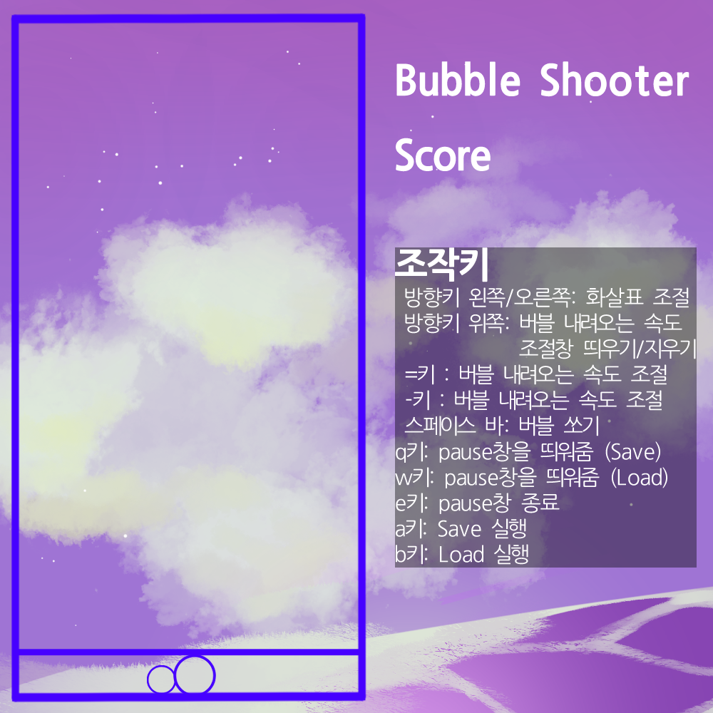

# bubble-shooter
[README for English ver.](./README-en.md)

## 완성일
최초 완성일: 2022.11.28 오후 5시 49분

수정 완성일: 2025.04.15 오전 00시 02분

## 실행 환경
Windows 11, Visual Studio (관리자 권한)

**windows.h 헤더파일을 사용**하기 때문에, **다른 환경에서는 실행이 불가능할 수 있습니다.**

**관리자 권한**으로 실행하지 않을 경우, 화면 사이즈 변경 및 화면이 안 뜨는 오류가 있습니다.

정상적으로 실행하기 위해서, **Windows 운영체제 / Visual Studio 관리자 권한**으로 실행해 주시기 바랍니다.

## 실행 방법
### 설치 
[Visual Studio 설치](https://visualstudio.microsoft.com/ko/thank-you-downloading-visual-studio/?sku=Community&channel=Release&version=VS2022&source=VSLandingPage&passive=false&cid=2030) > (Visual Studio Installer에서 수정 클릭) > 데스크톱 및 모바일 > C++을 사용한 데스크톱 개발 설치
### 실행
BubbleShooter.sln 을 **관리자 권한**으로 실행 > Ctrl + F5 을 눌러서 실행

## 게임 방법 (조작키)

## FAQ

1. 화면이 안 떠요!

1-1. 화면에 검정색만 나타나요! 
1-2. 화면 모서리에 검정색이 나타나요!

A1. 관리자 권한으로 실행 해 보세요

A2. 그래도 안 된다면 다음 설정을 확인해 주세요!
 - 프로젝트 > 속성 > 구성 속성 > 고급 > 문자집합 멀티바이트 문잡 집합 사용

2. 너무 느려요!

2-1. 키보드 입력이 안 되는 것 같아요! 
2-2. 화면이 멈췄어요!

A2. 저도 그래요...ㅜ 인내심을 가지고 기다린다면 언젠간 될 겁니다.

일단 코드가 돌아간 다는 것에 의의를 둡시다..!

3. 실행파일이 따로 없나요?

3-1. exe파일이 없나요?

A3. exe파일은 제가 어떻게 만드는지 몰라서 없습니다.

## 감성팔이
이 프로젝트는 고등학교 1학년, 콘솔 게임 만들기(C언어) 수행평가로 제출하였습니다.

고등학교 1학년 때의 실력을 최대한 그대로 보여드리기 위해, 수정은 최소화했습니다.

코드가 스파게티여도, 실제로 게임을 할 수 없을 정도로 느려서 속터지더라도

고등학교 1학년 학생 수-쥰이라고 생각하고, 너무 욕박지 말아주시길 주시길 바랍니다.

이해해 주셔서 감사합니다.

## 도움 받았어요
### 이미지 처리 헤더파일
|원본|개선|
|---|---|
|[링크](https://github.com/MinSeungHyun/CodeTheCompany/tree/master/ConsoleGame/ImageUtils)|[링크](https://hdox.de/manylayer)|

 > ./headers/ImageLayer.h
 >
 > ./headers/ImageLayerImpl.h
 > 
 > ./headers/ImageLayerInterface.h

### 이미지 파일
도움 (익명의 그림자)
 > ./images/StartScreen_*.bmp
 >
 > ./images/Bubble_*.bmp

## 저작권
[main.c](./main.c), [define.h](./headers/define.h), [FirstScreen.h](./headers/FirstScreen.h), [GameOver.h](./headers/GameOver.h), [GameScreen.h](./headers/GameScreen.h), [init.h](./headers/init.h), [music.h](./headers/music.h)

해당 파일들은 제가 혼자 작성하였으며, 저작권은 저에게 있습니다.

개인적인 용도로만 사용 가능하며, 그 외의 경우는 문의해 주시기 바랍니다.

Copyright 2025. Fingerissue All rights reserved.